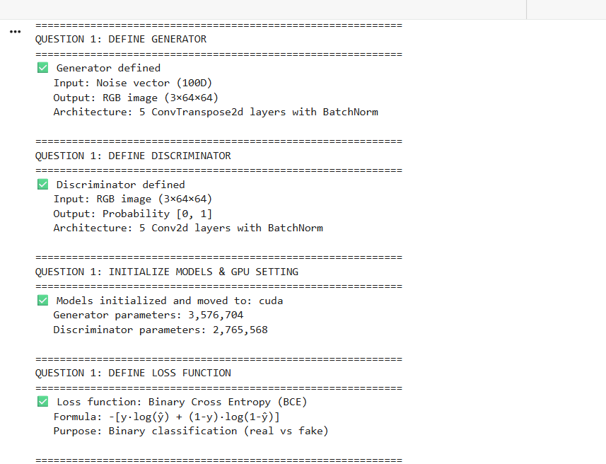

# 🧠 PyTorch Generative Models Lab

[](https://python.org)
[](https://pytorch.org)
[](LICENSE)

> **Master in MBD (Data Science)** — Faculty of Sciences and Technology of Tangier (FSTT)  
> **Author:** Chaimae Bouassab  
> **Date:** December 2025

---

## 📋 Overview

This laboratory explores three fundamental **generative model architectures** in deep learning using PyTorch:

| Model | Type | Key Characteristic |
|-------|------|-------------------|
| **Autoencoder (AE)** | Deterministic | Reconstruction-focused |
| **Variational Autoencoder (VAE)** | Probabilistic | Generation-focused |
| **Generative Adversarial Network (GAN)** | Adversarial | High-quality image synthesis |

---

## 🎯 Learning Objectives

Through this lab, I learned to:

- ✅ Build and train encoder-decoder architectures
- ✅ Understand the difference between deterministic and probabilistic latent spaces
- ✅ Implement the reparameterization trick for VAEs
- ✅ Design Generator and Discriminator networks for GANs
- ✅ Visualize and interpret latent space representations
- ✅ Compare reconstruction quality vs. generative capability

---

## 📁 Project Structure

```
PyTorch-Generative-Models-Lab/
├── atelier4.py                          # Main experiment script
├── README.md                            # This file
├── mnist image.png                      # Dataset samples
├── auto encoder build.png               # AE architecture
├── latent space.png                     # Latent space visualization
├── VISUALIZING LATENT SPACES.png        # AE vs VAE latent comparison
├── training vae.png                     # VAE training curves
├── quality of reconstruction.png        # Reconstruction comparison
├── EVALUATION COMPARING AE vs VAE.png   # Model comparison
├── GAN 1.png → GAN 5.png               # GAN training progression
└── completed tasks.png                  # Project checklist
```

---

# 🔬 Part 1: Autoencoders (AE & VAE)

## 📊 Dataset: MNIST Handwritten Digits


**What I learned:** MNIST is a classic benchmark dataset containing 60,000 training images of handwritten digits (0-9). Each image is 28×28 pixels in grayscale. This dataset is ideal for learning generative models because it's simple enough to train quickly but complex enough to demonstrate meaningful generation.

---

## 🏗️ Autoencoder Architecture


### 📚 Key Concepts Learned

**Architecture Overview:**
- **Encoder:** Compresses input image (784D) → latent representation (32D)
- **Decoder:** Reconstructs image from latent representation (32D → 784D)
- **Bottleneck:** Forces the network to learn efficient representations

**Training Results:**
```
Epoch  5/30 - Loss: 0.163295
Epoch 10/30 - Loss: 0.152845
Epoch 15/30 - Loss: 0.149103
Epoch 20/30 - Loss: 0.146307
Epoch 25/30 - Loss: 0.143597
Epoch 30/30 - Loss: 0.143597 ✓
```

**💡 Insight:** The autoencoder learns to compress images by ~96% (784 → 32 dimensions) while preserving enough information to reconstruct them. The decreasing loss shows successful learning.

---

## 📈 VAE Training Dynamics


### 📚 Key Concepts Learned

**VAE Loss Components:**
1. **Reconstruction Loss:** How well the model reconstructs inputs
2. **KL Divergence:** Regularizes latent space to follow N(0,1)

**Training Results:**
```
Epoch  5/30 - Total Loss: 137.72 - KL: 6.12
Epoch 10/30 - Total Loss: 131.27 - KL: 6.39
Epoch 15/30 - Total Loss: 128.16 - KL: 6.58
Epoch 20/30 - Total Loss: 126.10 - KL: 6.74
Epoch 25/30 - Total Loss: 124.48 - KL: 6.82
Epoch 30/30 - Total Loss: 124.67 - KL: 6.89 ✓
```

**💡 Insight:** The KL divergence increases slightly during training, indicating the model is learning a more structured latent space. This is the trade-off VAE makes: slightly worse reconstruction for better generation capability.

---

## 🗺️ Latent Space Visualization


### 📚 Key Concepts Learned

| Aspect | Autoencoder | VAE |
|--------|-------------|-----|
| **Clustering** | Tight, discrete clusters | Overlapping, continuous |
| **Gaps** | Empty regions between clusters | Filled, smooth space |
| **Interpolation** | May produce invalid outputs | Smooth transitions |
| **Sampling** | Cannot sample randomly | Can sample from N(0,1) |

**💡 Insight:** The VAE's latent space is **continuous and structured** thanks to KL divergence regularization. This means:
- Any point in latent space maps to a valid digit
- Interpolating between two points produces smooth morphing
- Random sampling generates realistic new digits

---

## 🔍 Reconstruction Quality Comparison


### 📚 Key Concepts Learned

**Observations:**
- **AE Reconstructions:** Sharper, more detailed, better pixel-wise accuracy
- **VAE Reconstructions:** Slightly blurrier but maintains digit structure

**Why the difference?**
- AE optimizes **only** for reconstruction → achieves lower MSE
- VAE optimizes for reconstruction **AND** latent regularity → trades some sharpness for structured latent space

**💡 Insight:** This is the fundamental **reconstruction vs. generation trade-off**. If you need faithful reconstruction, use AE. If you need to generate new samples, use VAE.

---

## ⚖️ AE vs VAE Evaluation


### 📚 Summary of Key Differences

| Criterion | Autoencoder (AE) | Variational AE (VAE) |
|-----------|------------------|----------------------|
| **Encoding** | Deterministic | Probabilistic (μ, σ) |
| **Latent Space** | Unstructured | Regularized to N(0,1) |
| **Loss Function** | MSE only | MSE + KL Divergence |
| **Reconstruction** | ⭐⭐⭐⭐⭐ Excellent | ⭐⭐⭐⭐ Good |
| **Generation** | ❌ Cannot generate | ✅ Can generate new samples |
| **Interpolation** | May fail | Smooth and meaningful |

### 🧠 Core Learning

> **"AE learns to compress; VAE learns to generate."**

The key innovation of VAE is the **reparameterization trick**: instead of outputting a single latent vector, the encoder outputs μ and σ, then samples z = μ + σ × ε (where ε ~ N(0,1)). This allows gradients to flow through the sampling operation.

---

# 🎮 Part 2: Generative Adversarial Networks (DCGAN)

## 📊 Dataset: Abstract Art Gallery

**Dataset Details:**
- **Source:** Kaggle (Abstract Art Gallery by Bryan)
- **Images:** 2,872 abstract art paintings
- **Resolution:** 64×64 RGB
- **Challenge:** More complex than MNIST (color, texture, composition)

---

## 🏗️ DCGAN Architecture

### Generator (G)
```
Input: Random noise z ~ N(0,1), shape (100, 1, 1)
       ↓
ConvTranspose2d: (100) → (512, 4, 4)   + BatchNorm + ReLU
       ↓
ConvTranspose2d: (512) → (256, 8, 8)   + BatchNorm + ReLU
       ↓
ConvTranspose2d: (256) → (128, 16, 16) + BatchNorm + ReLU
       ↓
ConvTranspose2d: (128) → (64, 32, 32)  + BatchNorm + ReLU
       ↓
ConvTranspose2d: (64)  → (3, 64, 64)   + Tanh
       ↓
Output: Fake image, shape (3, 64, 64), range [-1, 1]
```

### Discriminator (D)
```
Input: Image (real or fake), shape (3, 64, 64)
       ↓
Conv2d: (3)   → (64, 32, 32)  + LeakyReLU(0.2)
       ↓
Conv2d: (64)  → (128, 16, 16) + BatchNorm + LeakyReLU(0.2)
       ↓
Conv2d: (128) → (256, 8, 8)   + BatchNorm + LeakyReLU(0.2)
       ↓
Conv2d: (256) → (512, 4, 4)   + BatchNorm + LeakyReLU(0.2)
       ↓
Conv2d: (512) → (1, 1, 1)     + Sigmoid
       ↓
Output: Probability [0, 1] (0 = fake, 1 = real)
```

**Model Parameters:**
- Generator: **3,576,704** parameters
- Discriminator: **2,765,568** parameters

---

## 📈 GAN Training Progression

The following images show how the Generator improves over training epochs:

### Epoch 1-20: Early Training


**What I observed:** Early outputs are noisy and lack structure. The Generator is learning basic color distributions but hasn't captured texture or composition patterns yet.

---

### Epoch 20-40: Learning Structure


**What I observed:** Emerging shapes and color blobs. The Generator begins to understand spatial relationships but outputs are still blurry and lack detail.

---

### Epoch 40-60: Refinement


**What I observed:** More defined shapes and color transitions. The Generator is learning texture patterns characteristic of abstract art.

---

### Epoch 60-80: Quality Improvement


**What I observed:** Improved color harmony and composition. Generated images start to resemble plausible abstract artworks.

---

### Epoch 80-100: Final Results


**What I observed:** The Generator produces diverse, colorful abstract art with various styles. Some outputs show clear artistic patterns while others may exhibit mode collapse tendencies.

---

## 📊 GAN Training Metrics

### Training Dynamics
```
[  1/100] Loss_D: 0.2073  Loss_G: 6.2444  D(x): 0.9555  D(G(z)): 0.1280/0.0026
[...training progress...]
```

### 📚 Key Metrics Explained

| Metric | Meaning | Healthy Range |
|--------|---------|---------------|
| **Loss_D** | Discriminator's classification error | 0.3 - 0.8 |
| **Loss_G** | Generator's deception failure | Varies |
| **D(x)** | D's confidence on real images | ~0.5 - 0.9 |
| **D(G(z))** | D's confidence on fake images | ~0.1 - 0.5 |

**💡 Insight:** GAN training is a **minimax game**:
- Generator wants to maximize D(G(z))
- Discriminator wants to maximize D(x) and minimize D(G(z))
- Balance is key: if D is too strong, G can't learn; if G is too strong, mode collapse occurs

---

## 🧠 Key GAN Concepts Learned

### 1. Adversarial Training
```
min_G max_D V(D,G) = E[log D(x)] + E[log(1 - D(G(z)))]
```
The Generator and Discriminator compete, pushing each other to improve.

### 2. DCGAN Best Practices
- ✅ Use strided convolutions (no pooling)
- ✅ BatchNorm in both G and D (except first/last layers)
- ✅ LeakyReLU in D, ReLU in G
- ✅ Tanh activation for G output
- ✅ Adam optimizer with β₁ = 0.5

### 3. Common Issues
| Problem | Symptom | Solution |
|---------|---------|----------|
| **Mode Collapse** | G produces limited variety | Reduce learning rate, add noise |
| **Discriminator Domination** | G loss explodes | Train G more often |
| **Training Instability** | Oscillating losses | Use spectral normalization |

---

# 📝 Final Summary & Conclusions

## What I Learned

### 🎯 Autoencoders
1. **Compression:** AE learns efficient low-dimensional representations
2. **Limitation:** Cannot generate new samples (no regularized latent space)
3. **Use case:** Dimensionality reduction, denoising, anomaly detection

### 🎯 Variational Autoencoders
1. **Probabilistic:** Encodes to distribution (μ, σ), not single point
2. **Reparameterization:** z = μ + σ × ε enables backpropagation
3. **Trade-off:** Reconstruction quality vs. generation capability
4. **Use case:** Image generation, latent space exploration, data augmentation

### 🎯 GANs
1. **Adversarial game:** G and D improve through competition
2. **No explicit density:** GANs don't model p(x), just generate samples
3. **Sharp outputs:** Can produce higher quality images than VAE
4. **Challenge:** Training instability, mode collapse, hyperparameter sensitivity

---

## 🔄 Model Comparison

| Aspect | AE | VAE | GAN |
|--------|----|----|-----|
| **Training** | Stable | Stable | Unstable |
| **Output Quality** | Blurry | Blurry | Sharp |
| **Diversity** | N/A | Good | Risk of collapse |
| **Latent Space** | Unstructured | Structured | Not explicit |
| **Loss Function** | MSE | ELBO | Adversarial |

---

## 🚀 How to Reproduce

### Prerequisites
```bash
pip install torch torchvision matplotlib numpy tqdm
```

### Run Experiments
```bash
# Part 1: AE and VAE on MNIST
python atelier4.py

# Part 2: GAN on Abstract Art (requires Kaggle setup)
# See notebook for Kaggle API configuration
```

---

## 📚 References

1. Kingma, D. P., & Welling, M. (2014). *Auto-Encoding Variational Bayes*. ICLR.
2. Goodfellow, I., et al. (2014). *Generative Adversarial Networks*. NeurIPS.
3. Radford, A., Metz, L., & Chintala, S. (2016). *Unsupervised Representation Learning with DCGANs*. ICLR.
4. PyTorch Documentation: [pytorch.org/docs](https://pytorch.org/docs)

---

## ✅ Completed Tasks


---

<div align="center">

**🎓 Lab completed successfully!**

*Master in MBD (Data Science) — FSTT*

</div>
